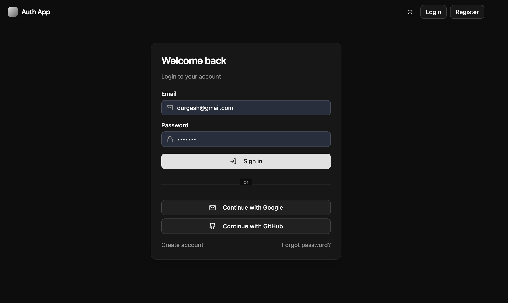

# Full Stack Authentication App - React + Vite + Spring Boot

A complete full-stack authentication system built with React, Vite, Tailwind CSS, and Spring Boot.

The application supports email/password authentication, JWT access tokens, refresh-token rotation, protected routes, Google OAuth login, GitHub OAuth login, profile management, and role-based authorization.

## Tech Stack

### Frontend

- React with Vite
- TypeScript
- Tailwind CSS
- Axios
- React Router
- Zustand state management
- ShadCN-style reusable UI components
- Dark/light mode

### Backend

- Spring Boot 3.x
- Spring Security 6.x
- Spring Data JPA
- MySQL
- OAuth2 Client for Google and GitHub
- JWT authentication
- Refresh token rotation
- BCrypt password hashing
- Lombok
- HikariCP
- Swagger/OpenAPI

## Screenshots

### Home Page


### Login Page



### Login Error


### Register Page


### Dashboard


## Project Structure

```text
auth-app-boot-react-dev/
│
├── auth-backend/              # Spring Boot backend API
│   ├── src/
│   ├── pom.xml
│   ├── Dockerfile
│   └── .env.example
│
├── auth-front/                # React + Vite frontend
│   ├── src/
│   ├── package.json
│   ├── vite.config.ts
│   ├── Dockerfile
│   └── .env.example
│
├── screenshots/               # Project screenshots
├── docker-compose.yml
├── run-backend.ps1
└── README.md
```

## Backend Setup

### Prerequisites

- Java 21+
- Maven 3.9+
- MySQL 8+
- Git

### Steps To Run Backend

1. Navigate to the backend folder:

```powershell
cd auth-backend
```

2. Create the database:

```sql
CREATE DATABASE auth_app;
```

3. Create a `.env` file inside `auth-backend/`.

You can copy the example file:

```powershell
copy .env.example .env
```

4. Configure backend environment variables:

```env
SPRING_PROFILES_ACTIVE=dev
SERVER_PORT=8082

DATABASE_URL=jdbc:mysql://localhost:3306/auth_app
DATABASE_USERNAME=root
DATABASE_PASSWORD=your-mysql-password
JPA_DDL_AUTO=update

JWT_SECRET=replace-with-at-least-64-random-characters-for-hs512-signing
JWT_ISSUER=auth-app
JWT_ACCESS_TTL_SECONDS=900
JWT_REFRESH_TTL_SECONDS=1209600
JWT_COOKIE_SECURE=false
JWT_COOKIE_SAME_SITE=Lax
JWT_COOKIE_DOMAIN=

GOOGLE_CLIENT_ID=your-google-client-id
GOOGLE_CLIENT_SECRET=your-google-client-secret
GITHUB_CLIENT_ID=your-github-client-id
GITHUB_CLIENT_SECRET=your-github-client-secret

FRONT_END_URL=http://localhost:5173
FRONT_END_SUCCESS_REDIRECT=http://localhost:5173/oauth/success
FRONT_END_FAILURE_REDIRECT=http://localhost:5173/oauth/failure
```

5. Run the Spring Boot app:

```powershell
mvn.cmd spring-boot:run
```

Backend runs on:

```text
http://localhost:8082
```

Swagger UI:

```text
http://localhost:8082/swagger-ui/index.html
```

## Frontend Setup

### Prerequisites

- Node.js 18+
- npm

### Steps To Run Frontend

1. Navigate to the frontend folder:

```powershell
cd auth-front
```

2. Install dependencies:

```powershell
npm.cmd install
```

3. Create a `.env` file inside `auth-front/`.

You can copy the example file:

```powershell
copy .env.example .env
```

4. Configure frontend environment variables:

```env
VITE_BASE_URL=http://localhost:8082
VITE_API_BASE_URL=http://localhost:8082/api/v1
```

5. Start the development server:

```powershell
npm.cmd run dev
```

Frontend runs on:

```text
http://localhost:5173
```

## Authentication Flow

### Email And Password Login

1. User registers with name, email, and password.
2. Password is hashed with BCrypt.
3. User logs in using email and password.
4. Backend returns a JWT access token and sets a refresh token cookie.
5. Frontend stores the access token in memory and uses it for protected API calls.

### OAuth Login

1. User clicks Google or GitHub login.
2. Backend redirects the user to the OAuth provider.
3. On success, backend creates or updates the user in the database.
4. If the same email already exists, the account is merged.
5. Backend sets a refresh token cookie.
6. Frontend calls refresh endpoint and receives a new access token.

### Token Refresh

1. Access tokens are short-lived.
2. Refresh tokens are stored server-side and rotated.
3. Axios interceptors automatically request a new access token when needed.

### Logout

1. Refresh token is revoked in the database.
2. Refresh token cookie is cleared.
3. Current access token is blacklisted.
4. Frontend clears local auth state.

## API Endpoints

| Method | Endpoint | Description |
| --- | --- | --- |
| `POST` | `/api/v1/auth/register` | Register a new user |
| `POST` | `/api/v1/auth/login` | Login with email and password |
| `POST` | `/api/v1/auth/refresh` | Refresh access token |
| `GET` | `/api/v1/auth/me` | Get current logged-in user |
| `PATCH` | `/api/v1/auth/me` | Update current user profile |
| `POST` | `/api/v1/auth/logout` | Logout and revoke tokens |
| `GET` | `/oauth2/authorization/google` | Start Google OAuth login |
| `GET` | `/oauth2/authorization/github` | Start GitHub OAuth login |
| `GET` | `/api/v1/users` | Get all users, admin protected |

## Environment Variables

| Variable | Description | Example |
| --- | --- | --- |
| `DATABASE_URL` | JDBC database URL | `jdbc:mysql://localhost:3306/auth_app` |
| `DATABASE_USERNAME` | Database username | `root` |
| `DATABASE_PASSWORD` | Database password | `password` |
| `JWT_SECRET` | Secret key for JWT signing | `64-character-random-secret` |
| `JWT_ISSUER` | JWT issuer name | `auth-app` |
| `GOOGLE_CLIENT_ID` | Google OAuth client ID | `xxxxx.apps.googleusercontent.com` |
| `GOOGLE_CLIENT_SECRET` | Google OAuth secret | `xxxxxx` |
| `GITHUB_CLIENT_ID` | GitHub OAuth client ID | `github-client-id` |
| `GITHUB_CLIENT_SECRET` | GitHub OAuth secret | `github-client-secret` |
| `FRONT_END_URL` | Allowed frontend origin | `http://localhost:5173` |
| `VITE_BASE_URL` | Backend base URL for OAuth redirects | `http://localhost:8082` |
| `VITE_API_BASE_URL` | Backend API base URL | `http://localhost:8082/api/v1` |

## Common Commands

| Task | Command |
| --- | --- |
| Run backend | `mvn.cmd spring-boot:run` |
| Package backend | `mvn.cmd -DskipTests package` |
| Run frontend | `npm.cmd run dev` |
| Build frontend | `npm.cmd run build` |
| Preview frontend build | `npm.cmd run preview` |
| Run with Docker | `docker compose up --build` |

## Docker Setup

Create a root `.env` file from `.env.example`:

```powershell
copy .env.example .env
```

Then run:

```powershell
docker compose up --build
```

Docker starts:

- MySQL database
- Spring Boot backend
- React frontend served through Nginx

## Security Features

- BCrypt password hashing
- JWT access tokens
- Refresh-token rotation
- Server-side refresh token storage
- Access-token blacklist on logout
- HTTP-only refresh token cookie
- CORS configuration through environment variables
- Role-based authorization with `ROLE_USER` and `ROLE_ADMIN`
- No production secrets hardcoded in source code

## Deployment Notes

### Frontend

Build the frontend:

```powershell
cd auth-front
npm.cmd run build
```

Deploy the `dist/` folder to:

- Vercel
- Netlify
- Nginx
- Any static hosting provider

### Backend

Package the backend:

```powershell
cd auth-backend
mvn.cmd -DskipTests package
```

Deploy the generated JAR from:

```text
auth-backend/target/
```

For production:

- Use HTTPS.
- Set `JWT_COOKIE_SECURE=true`.
- Use a strong `JWT_SECRET`.
- Use production database credentials.
- Update OAuth redirect URLs in Google and GitHub developer consoles.
- Set frontend and backend environment variables on the hosting platform.

## Author

Built and customized by **Code Smasher**.

## License

This project is available for learning, customization, and portfolio use.

If this project helps you, consider giving the repository a star.
